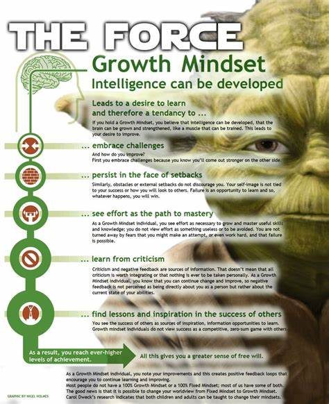

# Reading Journal 

## Lab: 01b - Learning Markdown

A growth mindset is the base foundation that addresses complex fixed reactions, and negative responses with positive ideas towards finding solutions. 

### Reminders  
1. ~~I give up~~ What am I missing? 
2. ~~This is good enough~~ Is this my best? 
3. ~~This is hard~~ This is a process 

